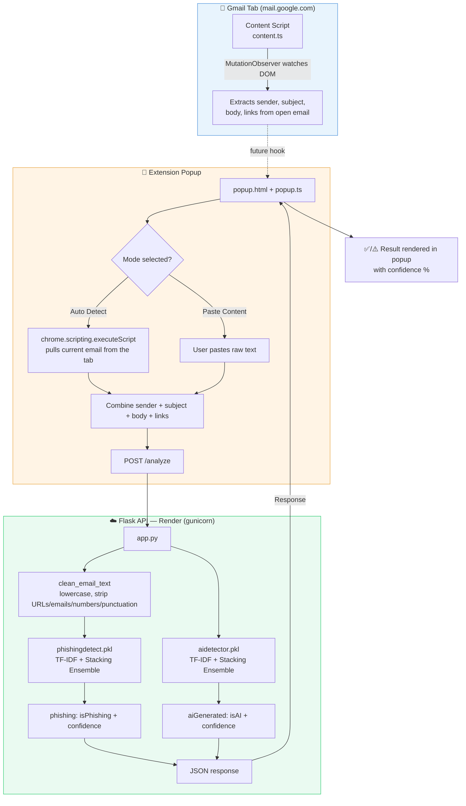

# 🛡️ Phishing Guard (WatchTower)

A Chrome extension + Flask API that reads the email you're looking at in Gmail (or text you paste in) and tells you two things in real time:

1. **Is this phishing?**
2. **Was this written by AI?**

Both answers come from two independently trained scikit-learn stacking-ensemble models served behind a small Flask API, called live from a Manifest V3 Chrome extension written in strict TypeScript.

> Extension display name: **WatchTower** — package/repo name: **phishing-guard**.

---

## Table of Contents

- [Architecture](#-architecture)
- [Tech Stack](#-tech-stack)
- [Repository Structure](#-repository-structure)
- [How the Frontend (Extension) Works](#-how-the-frontend-extension-works)
- [How the Backend Works](#-how-the-backend-works)
- [How the ML Models Are Trained](#-how-the-ml-models-are-trained)
- [Getting Started](#-getting-started)
- [API Reference](#-api-reference)
- [CI/CD](#-cicd)
- [Roadmap / Known Gaps](#-roadmap--known-gaps)
- [Contributing Workflow](#-contributing-workflow)
- [License](#-license)

---

## 🧭 Architecture



**Flow in words:**
1. The **content script** silently watches the open Gmail thread (currently logs data — foundation for future auto-badging).
2. The **popup**, when opened, either auto-extracts the currently open email via `chrome.scripting.executeScript` or takes pasted text.
3. That text is sent to the **Flask backend's** `/analyze` endpoint.
4. The backend cleans the text and runs it through **two separate pre-trained models** (phishing classifier + AI-text classifier).
5. Both predictions (label + confidence) come back as JSON and are rendered instantly in the popup.

---

## 🧱 Tech Stack

| Layer | Technology |
|---|---|
| Extension | TypeScript (strict mode, no framework), Chrome Extension **Manifest V3** |
| Extension build | `tsc` (TypeScript compiler), compiled output committed via CI |
| Backend | Python, **Flask**, `flask-cors` |
| Backend server | **Gunicorn** (`Procfile`), deployed on **Render** |
| ML / Data science | **scikit-learn**, **XGBoost**, `pandas`, `numpy`, Jupyter Notebooks |
| Model persistence | `pickle` (`.pkl` files loaded directly by Flask) |
| CI/CD | GitHub Actions (auto-compiles TS → JS on push to `main`) |
| Versioning | Git / GitHub, feature-branch workflow |

Language breakdown in the repo (per GitHub): mostly **Jupyter Notebook** (model training/experimentation), then Python (Flask backend), then TypeScript (extension).

---

## 📁 Repository Structure

```
phishing-guard/
│
├── .github/workflows/
│   └── build.yml              # Auto-compiles extension TS → JS on push
│
├── backend/
│   ├── app.py                 # Flask API — loads both .pkl models, exposes /analyze
│   ├── requirements.txt       # flask, flask-cors, scikit-learn, xgboost, gunicorn
│   └── Procfile                # gunicorn start command for deployment
│
├── mlmodel/
│   ├── phishing_detection.ipynb     # Trains the phishing text classifier
│   ├── ai_model_on_detection.ipynb  # Trains the AI-generated-text classifier
│   ├── phishingdetect.pkl           # Serialized phishing pipeline
│   ├── aidetector.pkl               # Serialized AI-detector pipeline
│   └── README.md                    # Links to standalone Streamlit demos
│
├── extension/
│   ├── src/
│   │   ├── content.ts          # Runs inside Gmail, extracts email DOM data
│   │   ├── background.ts       # Service worker (reserved for future use)
│   │   ├── popup.ts            # Popup logic — calls backend, renders result
│   │   └── definitions.ts      # Shared TypeScript interfaces
│   ├── load/
│   │   ├── manifest.json       # MV3 manifest
│   │   ├── popup.html
│   │   ├── style.css
│   │   ├── assets/              # Icons
│   │   └── dist/                 # Compiled JS (auto-generated, don't hand-edit)
│   ├── package.json / package-lock.json
│   └── tsconfig.json
│
├── LICENSE                     # MIT
└── README.md
```

---

## 🧩 How the Frontend (Extension) Works

The extension is **plain TypeScript** compiled to vanilla JS — no React, Vue, or bundler-driven framework. It's a classic Manifest V3 extension with three JS contexts:

### 1. `manifest.json`
- Registers `background.ts` as an ES-module **service worker**.
- Injects `content.ts` into every frame of `https://mail.google.com/*` at `document_idle`.
- Grants `activeTab` + `scripting` permissions, and host permission for the deployed backend URL, so the popup is allowed to `fetch()` it.

### 2. `content.ts` — runs inside Gmail
- Sets up a `MutationObserver` on `document.body` to react as Gmail's SPA re-renders the DOM when you open a new email.
- Extracts `senderEmail`, `senderName`, `subject`, `body`, and all `links` from the currently open thread using Gmail's DOM structure (`span[email]`, `div.a3s`, etc.).
- Currently logs the extracted `EmailData` to the console whenever the subject changes — this is the hook future work (e.g., an automatic in-page warning banner) will build on.

### 3. `popup.ts` — the UI you interact with
- Two modes, toggled via radio buttons:
  - **Auto Detect** — uses `chrome.scripting.executeScript` to reach into the active tab and pull the currently open Gmail email (same extraction logic as the content script).
  - **Paste Content** — a plain `<textarea>` for pasting any email/SMS/text.
- On analyze, it builds a single text blob (sender + subject + body + links) and `POST`s it as JSON to the backend's `/analyze` endpoint.
- Renders both results together, e.g. `⚠️ Phishing (91.2%) | 🤖 AI-generated (73.4%)`, with buttons disabled while the request is in flight and clear error states if the fetch fails.

All shared types (`EmailData`, `AnalyzeResponse`, `EmailExtractResult`) live in `definitions.ts` so the popup and content script never disagree on shape.

**Why strict TypeScript?** `tsconfig.json` enables `strict`, `noUncheckedIndexedAccess`, and `exactOptionalPropertyTypes` — meaning DOM lookups like `document.querySelector(...)` are typed as possibly `null`/`undefined` everywhere, forcing safe optional chaining (`?.`) instead of runtime crashes when Gmail's DOM doesn't match expectations.

---

## ⚙️ How the Backend Works

`backend/app.py` is a small, single-file **Flask** app:

1. On startup, it loads both trained pipelines straight from disk:
   ```python
   phishing_model = pickle.load(open("mlmodel/phishingdetect.pkl", "rb"))
   ai_model       = pickle.load(open("mlmodel/aidetector.pkl", "rb"))
   ```
2. `clean_email_text()` normalizes input before it hits the **phishing** model: lowercases, replaces URLs → `url`, emails → `email`, digits → `number`, strips punctuation, collapses whitespace. (The AI-text detector intentionally receives the **raw, uncleaned** text, since stylistic cues like punctuation and casing matter for detecting AI-generated writing.)
3. `POST /analyze` accepts `{ "text": "..." }`, rejects empty input or text over 20,000 characters, runs both pipelines, and returns:
   ```json
   {
     "phishing":     { "isPhishing": true, "confidence": 0.912 },
     "aiGenerated":  { "isAI": false, "confidence": 0.187 }
   }
   ```
4. `GET /health` is a trivial liveness check.
5. `flask-cors` is enabled so the extension (running from a `chrome-extension://` origin) is allowed to call the API directly from the popup.
6. In production it's run with **Gunicorn** (`Procfile`: `gunicorn app:app --workers 2 --timeout 60`), consistent with it being deployed on **Render** (the manifest's `host_permissions` points at a `*.onrender.com` URL).

---

## 🧠 How the ML Models Are Trained

Both models live as Jupyter notebooks in `mlmodel/` and follow the same recipe: **TF-IDF vectorization → stacked ensemble of diverse classifiers → XGBoost as the meta-learner**, wrapped in a single `sklearn.Pipeline` so `.pkl` load and `.predict()` "just work" in production with no separate preprocessing step to keep in sync.

### Model 1 — Phishing Text Classifier (`phishing_detection.ipynb` → `phishingdetect.pkl`)

| Step | Detail |
|---|---|
| Data | `phishing_email.csv` — combined text + binary `label` column |
| Cleaning | Same `clean_email_text()` used in the backend (URLs/emails/numbers/punctuation normalized) |
| Split | 80/20 train/test, `random_state=42` |
| Vectorizer | `TfidfVectorizer(max_features=10000, ngram_range=(1,2), stop_words="english")` |
| Base learners | `LogisticRegression(C=2.0)`, `RandomForestClassifier(n_estimators=100, max_depth=15)`, `CalibratedClassifierCV(LinearSVC(C=1.0))` |
| Meta-learner | `XGBClassifier(n_estimators=100, learning_rate=0.1, max_depth=4)` |
| Ensembling | `StackingClassifier` with 5-fold CV to generate out-of-fold predictions for the meta-learner |
| Evaluation | `accuracy_score`, `confusion_matrix`, `classification_report` |

### Model 2 — AI-Generated Text Detector (`ai_model_on_detection.ipynb` → `aidetector.pkl`)

| Step | Detail |
|---|---|
| Data | Streamed from **RAID** (`liamdugan/raid`, 50k sampled rows) + **HC3** (`Hello-SimpleAI/HC3`, human vs. ChatGPT answers), concatenated |
| Balancing | AI examples oversampled to roughly a 55:45 AI:human ratio |
| Split | `GroupShuffleSplit` (85/15) grouped by `source_id`, so the same source text can't leak across train and test |
| Vectorizer | `TfidfVectorizer(max_features=5000, ngram_range=(1,2))` |
| Base learners | `LogisticRegression`, `SGDClassifier(loss="log_loss")`, `MultinomialNB(alpha=0.1)` |
| Meta-learner | `XGBClassifier(n_estimators=100, learning_rate=0.05, max_depth=4)` |
| Ensembling | `StackingClassifier`, 3-fold CV |
| Evaluation | Same accuracy/confusion-matrix/report trio, plus manual inspection of misclassified examples |

Both notebooks end by pickling the full `Pipeline` (vectorizer + ensemble together) so the backend never has to re-implement feature extraction — it just unpickles and calls `.predict()` / `.predict_proba()`.

> Standalone Streamlit demos of each model (outside the extension) are linked in `mlmodel/README.md`.

---

## 🚀 Getting Started

### 1. Clone

```bash
git clone https://github.com/amrit-11022007/phishing-guard.git
cd phishing-guard
```

### 2. Run the backend locally

```bash
cd backend
pip install -r requirements.txt
python app.py          # dev server on http://localhost:5000
# or, production-style:
gunicorn app:app --bind 0.0.0.0:5000
```
Make sure `mlmodel/phishingdetect.pkl` and `mlmodel/aidetector.pkl` exist relative to `backend/` (the app expects `../mlmodel/`).

### 3. Build the extension

```bash
cd extension
npm install
npx tsc              # compiles src/ -> load/dist/
# or: npx tsc --watch
```

### 4. Load it in Chrome

1. Go to `chrome://extensions`
2. Enable **Developer mode**
3. Click **Load unpacked**
4. Select `extension/load/`

If you're running the backend locally instead of the hosted Render URL, update `API_URL` in `popup.ts` and the matching `host_permissions` entry in `manifest.json`, then recompile.

---

## 📡 API Reference

**Base URL:** deployed at `https://phishing-guard-87k1.onrender.com` (see `manifest.json`)

| Endpoint | Method | Body | Response |
|---|---|---|---|
| `/health` | GET | — | `{ "status": "ok" }` |
| `/analyze` | POST | `{ "text": string }` (max 20,000 chars) | `{ "phishing": {...}, "aiGenerated": {...} }` |

---

## 🔁 CI/CD

`.github/workflows/build.yml` triggers on any push to `main` that touches `extension/src/**`, `package.json`, or `tsconfig.json`. It installs dependencies, runs `npx tsc`, and **commits the compiled `extension/load/dist/` output straight back to the repo** — so `main` always has ready-to-load compiled JS without contributors needing to remember to build before pushing.

---

## 🗺️ Roadmap / Known Gaps

- `background.ts` is currently an empty service worker — reserved for coordinating popup ↔ content-script messaging or moving analysis calls off the popup thread.
- `content.ts` only logs extracted email data today; it doesn't yet inject an in-page warning banner.
- No URL-reputation/blocklist check (e.g., PhishTank/Google Safe Browsing) is wired in yet — detection is currently text-only, based on the two ML models.
- No automated tests are present for either the extension or the backend yet.

---

## 🤝 Contributing Workflow

- Don't commit directly to `main` — create a feature branch (`git checkout -b your-feature`).
- Pull latest `main` before starting new work.
- Keep commits focused and descriptive (`Add popup text input`, not `stuff`/`fix`).
- Open a Pull Request into `main`; resolve conflicts locally with `git merge main` before merging.
- Never commit `.env` files or API keys.

---

## 📄 License

MIT — see [`LICENSE`](./LICENSE).
